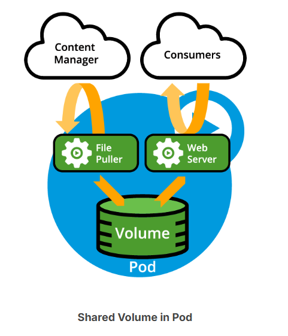
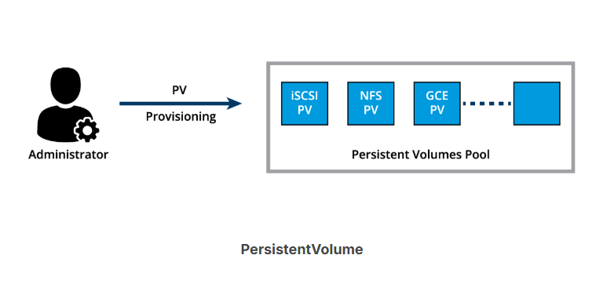

# K8s-Volume-Management.

In today's business model, data is the most precious asset for many startups and enterprises. In a Kubernetes cluster, containers in Pods can be either data producers, data consumers, or both. While some container data is expected to be transient and is not expected to outlive a Pod, other forms of data must outlive the Pod in order to be aggregated and possibly loaded into analytics engines. Kubernetes must provide storage resources in order to provide data to be consumed by containers or to store data produced by containers.

Kubernetes uses Volumes of several types and a few other forms of storage resources for container data management. In this chapter, we will talk about ephemeral Volume definitions, PersistentVolume and PersistentVolumeClaim objects, which help us attach persistent storage Volumes to Pods.

## Volumes

As we know, containers running in Pods are ephemeral in nature. All data stored inside a container is deleted if the container crashes. However, the kubelet will restart it with a clean slate, which means that it will not have any of the old data.

To overcome this problem, Kubernetes uses ephemeral Volumes, storage abstractions that allow various storage technologies to be used by Kubernetes and offered to containers in Pods as storage media. An ephemeral Volume is essentially a mount point on the container's file system backed by a storage medium. The storage medium, content and access mode are determined by the Volume Type.

In Kubernetes, an ephemeral Volume is linked to a Pod and can be shared among the containers of that Pod. Although the ephemeral Volume has the same life span as the Pod, meaning that it is deleted together with the Pod, the ephemeral Volume outlives the containers of the Pod - this allows data to be preserved across container restarts.

## Container Storage Interface (CSI)

Container orchestrators like Kubernetes, Mesos, Docker or Cloud Foundry used to have their own methods of managing external storage using Volumes. For storage vendors, it was challenging to manage different Volume plugins for different orchestrators. A maintainability challenge for Kubernetes as well, it involved in-tree storage plugins integrated into the orchestrator's source code. Storage vendors and community members from different orchestrators started working together to standardize the Volume interface - a volume plugin built using a standardized Container Storage Interface (CSI) designed to work on different container orchestrators with a variety of storage providers. Explore the CSI specifications for more details.

Between Kubernetes releases v1.9 and v1.13 CSI matured from alpha to stable support, which makes installing new CSI-compliant Volume drivers very easy. CSI allows third-party storage providers to develop solutions without the need to add them into the core Kubernetes codebase. These solutions are CSI drivers installed only when required by cluster administrators.

## Volume Types

A directory which is mounted inside a Pod is backed by the underlying Volume Type. A Volume Type decides the properties of the directory, like size, content, default access modes, etc. Some examples of Volume Types that support ephemeral Volumes are:

- **emptyDir**

An empty Volume is created for the Pod as soon as it is scheduled on the worker node. The Volume's life is tightly coupled with the Pod. If the Pod is terminated, the content of emptyDir is deleted forever.  

- **hostPath**

The hostPath Volume Type shares a directory between the host and the Pod. If the Pod is terminated, the content of the Volume is still available on the host.

- **gcePersistentDisk**

The gcePersistentDisk Volume Type mounts a Google Compute Engine (GCE) persistent disk into a Pod.

- **awsElasticBlockStore**

The awsElasticBlockStore Volume Type mounts an AWS EBS Volume into a Pod. 

- **azureDisk**

The azureDisk mounts a Microsoft Azure Data Disk into a Pod.

- **azureFile**

The azureFile mounts a Microsoft Azure File Volume into a Pod.

- **cephfs**

The cephfs allows for an existing CephFS volume to be mounted into a Pod. When a Pod terminates, the volume is unmounted and the contents of the volume are preserved.

- **nfs**

The nfs mounts an NFS share into a Pod.

- **iscsi**

The iscsi mouns an iSCSI share into a Pod.

- **secret**

The secret Volume Type facilitates the supply of sensitive information, such as passwords, certificates, keys, or tokens to Pods.

- **configMap**

The configMap objects facilitate the supply of configuration data, or shell commands and arguments into a Pod.

- **persistentVolumeClaim**

A PersistentVolume is consumed by a Pod using a persistentVolumeClaim. 

You can learn more details about Volume Types from the documentation. However, do not be alarmed by the “deprecated” and “removed” notices. They have been added as means of tracking the original in-tree plugins which eventually migrated to the CSI driver implementation. Kubernetes native plugins do not show such a notice.

## PersistentVolumes

In a typical IT environment, storage is managed by the storage/system administrators. The end user will just receive instructions to use the storage but is not involved with the underlying storage management.

In the containerized world, we would like to follow similar rules, but it becomes challenging, given the many Volume Types we have seen earlier. Kubernetes resolves this problem with the PersistentVolume (PV) subsystem, which provides APIs for users and administrators to manage and consume persistent storage. To manage the Volume, it uses the PersistentVolume API resource type, and to consume it, it uses the PersistentVolumeClaim API resource type.

A Persistent Volume is a storage abstraction backed by several storage technologies, which could be local to the host where the Pod is deployed with its application container(s), network attached storage, cloud storage, or a distributed storage solution. A Persistent Volume is statically provisioned by the cluster administrator. 

PersistentVolumes can be dynamically provisioned based on the StorageClass resource. A StorageClass contains predefined provisioners and parameters to create a PersistentVolume. Using PersistentVolumeClaims, a user sends the request for dynamic PV creation, which gets wired to the StorageClass resource.

Some of the Volume Types that support managing storage using PersistentVolumes are:

- GCEPersistentDisk

- AWSElasticBlockStore

- AzureFile

- AzureDisk

- CephFS

- NFS

- iSCSI

For a complete list, as well as more details, you can check out the types of Persistent Volumes. The Persistent Volume types use the same CSI driver implementations as ephemeral Volumes.

## PersistentVolumeClaims
A PersistentVolumeClaim (PVC) is a request for storage by a user. Users request for PersistentVolume resources based on storage class, access mode, size, and optionally volume mode. 

There are four access modes: 
- ReadWriteOnce (read-write by a single node)
- ReadOnlyMany (read-only by many nodes)
- ReadWriteMany (read-write by many nodes)
- ReadWriteOncePod (read-write by a single pod).
  
The optional volume modes, filesystem or block device, allow volumes to be mounted into a pod's directory or as a raw block device respectively. By design Kubernetes does not support object storage, but it can be implemented with the help of custom resource types. Once a suitable PersistentVolume is found, it is bound to a PersistentVolumeClaim. 
